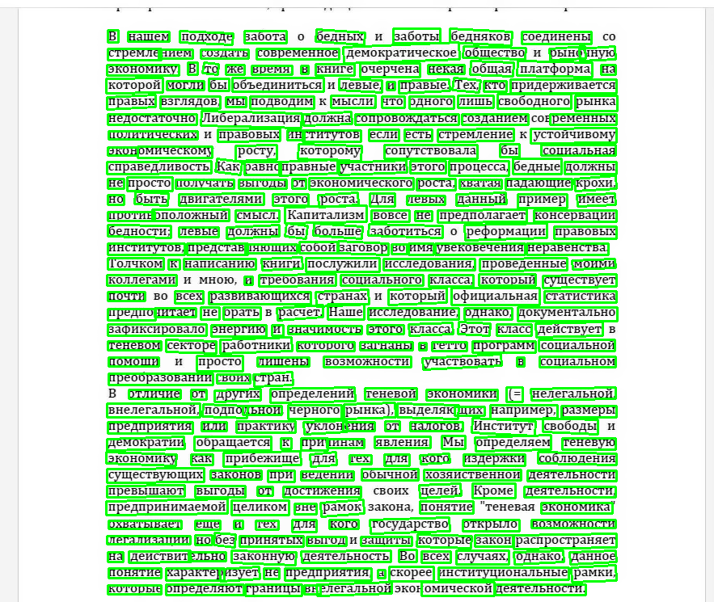
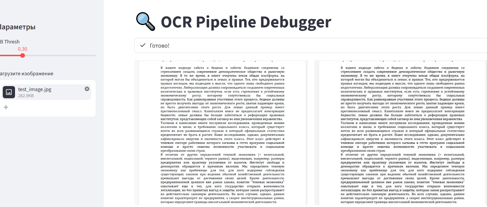
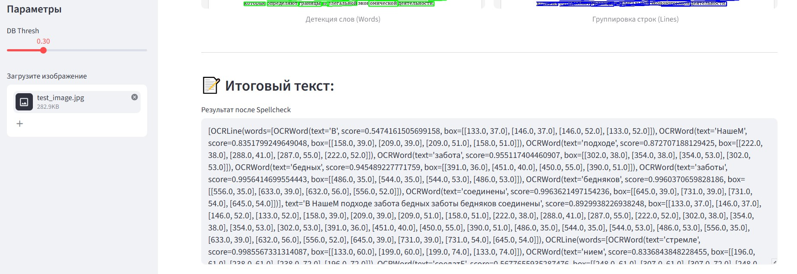

# OCR-M: High-Performance Offline OCR Module

**OCR-M (OCR-Module)** — это готовый к продакшену инструмент для извлечения текста из изображений и сканов документов (включая сложные кейсы: старые архивы, DjVu-сканы, зашумленные учебники). 

Проект построен на базе **PaddleOCR (v4/v5)** и оптимизирован для работы в полностью автономном (Air-gapped) режиме без доступа к интернету.

---

## 🚀 Ключевые особенности (Highlights)

*   **Полная автономность:** Модели загружаются локально из папки `models/`. Никаких внешних запросов к HuggingFace или Baidu при старте.
*   **Продвинутый Preprocessing:** Умная очистка изображений с использованием OpenCV (Адаптивный контраст CLAHE, устранение перекоса Deskew, медианное шумоподавление).
*   **Интеллектуальный Postprocessing:** Исправление ошибок распознавания с помощью алгоритма SymSpell (Compound Lookup), что критично для "битых" сканов.
*   **Docker-Native:** Готовый оптимизированный Dockerfile на базе `python-slim` со всеми системными зависимостями (OpenGL, libgomp).
*   **Промышленная архитектура:** Четкое разделение на модули (OCR, NLP, Utils), наличие тестов (Pytest) и Makefile для автоматизации.

---

## 🛠 Технологический стек

- **Core:** Python 3.10+, PaddlePaddle, PaddleOCR.
- **Computer Vision:** OpenCV (headless), NumPy, Scikit-Image.
- **NLP:** SymSpell (SymSpellPy), Pyclipper, Shapely.
- **DevOps/QA:** Docker, Pytest, Makefile.

---

## 🏗 Пайплайн обработки (Pipeline)

Проект реализует полный цикл извлечения данных:
1.  **Image Input** (JPG, PNG, TIFF).
2.  **Preprocessing:** 
    *   `Deskewing`: выравнивание наклона строк.
    *   `CLAHE`: нормализация освещения и теней.
    *   `Denoising`: удаление мелкого "шума" со старых страниц.
3.  **OCR Engine:** 
    *   Детекция текста (DBNet).
    *   Распознавание (CRNN + CTC Loss).
4.  **Postprocessing:** 
    *   Спеллчекер по словарям (RU/EN).
    *   Нормализация символов и удаление артефактов.
5.  **Output:** Очищенный текст / Структурированные данные.

---

## 📦 Быстрый старт (Quick Start)

### 1. Подготовка моделей
Поскольку веса моделей весят >100Мб, они не хранятся в Git. Скачайте их с помощью скрипта:
```bash
python scripts/download_models.py v4 mobile ru
```

### 2. Запуск через Docker (Рекомендуется)
Самый простой способ запустить модуль без настройки окружения:
```bash
# Сборка образа
docker build -t ocr_module .

# Запуск обработки (мапим папки input/output)
docker run --rm \
  -v "$(pwd)/data/input:/app/data/input" \
  -v "$(pwd)/data/output:/app/data/output" \
  ocr_module
```

### 3. Локальный запуск
```bash
pip install -r requirements.txt
python app/main.py
```

Или проще с помощью MAKE
```bash
#Собираем образ
make build
#Запуск
make run
```

---

### 🧬 Диагностика и Визуализация (Debug Mode)

В проекте реализован модуль для глубокого анализа работы пайплайна. Он позволяет визуализировать детекцию текста, проверить точность распознавания и замерить время обработки каждого этапа.

**Запуск отладки:**
```bash
python -m app.debug
```
Результаты работы сохраняются в директории debug/.

### 📸Пример(Visualization)

### 📃Пример(Логгер):
- [1/6] preprocess .......... 231 ms
- [2/6] run ocr ............. 4365 ms
- [3/6] to words ............ 0 ms
- [4/6] sort boxes .......... 0 ms
- [5/6] group lines ......... 3 ms
- [6/6] postprocess ......... 1 ms


---
###Streamlit UI🔍
Интерактивная панель для калибровки параметров распознавания в реальном времени.
```bash
python -m streamlit run app/app_ui.py
```





---

## 🧪 Тестирование
Проект покрыт тестами для проверки логики нормализации текста и инициализации моделей:
```bash
pytest tests/
```

---

## 📂 Структура проекта
```text
├── app/                # Ядро приложения
│   ├── ocr/            # Двигатель распознавания и препроцессинг
│   ├── text/           # NLP логика и коррекция ошибок
│   └── utils/          # Логирование, визуализация, пути
├── data/               # Входные и выходные данные
├── models/             # Локальные веса моделей (в .gitignore)
├── tests/              # Набор тестов (Pytest)
└── Dockerfile          # Оптимизированный образ для деплоя
```

---

## 📝 Лицензия
Distributed under the MIT License. См. `LICENSE` для подробностей.

---
**Разработчик:** Shimoze 

**Контакты:** 
Telegram: [@HalalSapiens](https://t.me/HalalSapiens)

